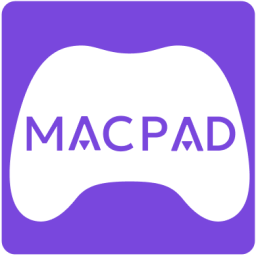

# Pikapad 🎮➡️💻

Transform your gamepad into a powerful Mac OS control tool. Navigate, click, and type with ease using your favorite controller.



## 🌟 Features

- **Analog Mouse Control**: Use your gamepad's analog stick to smoothly move the mouse cursor across your Mac's screen.
- **Button Mapping (Coming Soon)**: Map gamepad buttons to mouse clicks, making navigation intuitive and effortless.
- **Built-in Keyboard**: Quickly bring up an on-screen keyboard with a single button press.

## 📸 Screenshots


## 🚀 Installation

### Prerequisites

- Node.js
- Electron

### Local Setup

<!-- Provide step-by-step instructions for setting up the project locally -->

```bash
# Example clone command
git clone https://github.com/yourusername/pikapad.git

# Navigate to project directory
cd pikapad

# Install dependencies
# Add your specific installation commands here
npm i
npm run dev
```

## 🛠️ Building the Project

### Build Instructions

<!-- Detailed instructions on how to build the project from source -->

```bash
# Example build commands
# Add your specific build process here
npm run build:mac
```

## 💻 Usage

<!-- Provide basic usage instructions -->

1. Connect your gamepad
2. Launch Pikapad
3. Start controlling your Mac with your gamepad!

## 💖 Support the Project

If you find Pikapad useful, consider supporting its development:

- Star the GitHub repository
- [Donate via Ko-fi](https://ko-fi.com/xbracey)
- Spread the word!

## 📄 License

MIT License

---

**Disclaimer**: Pikapad is an open-source project and is not officially affiliated with Apple or Mac OS.
